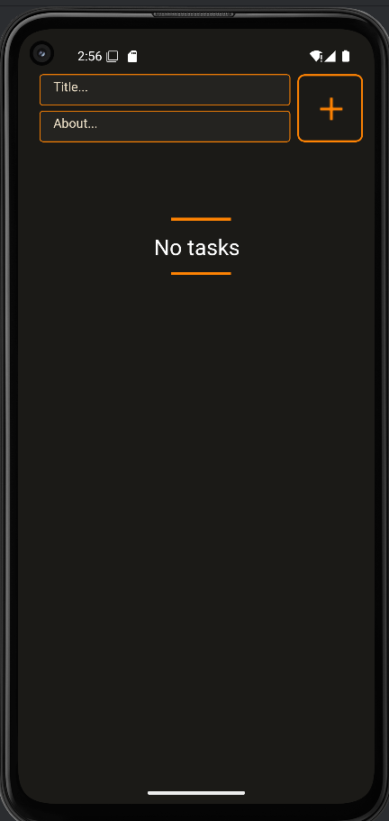
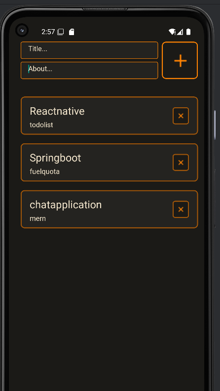
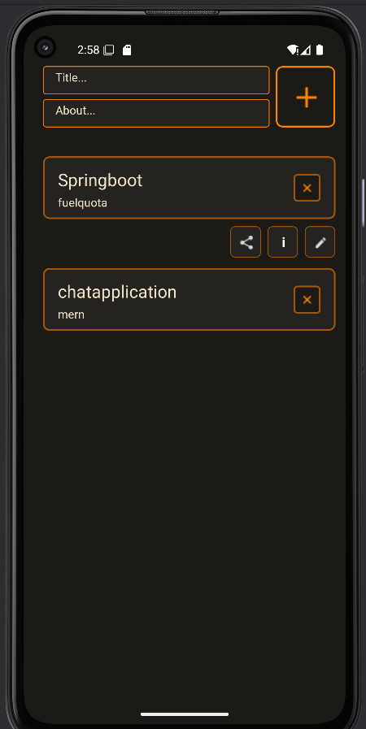
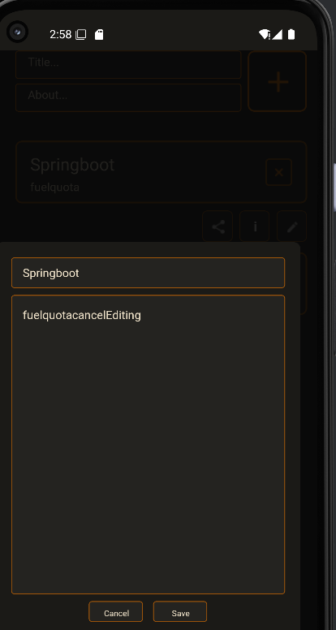
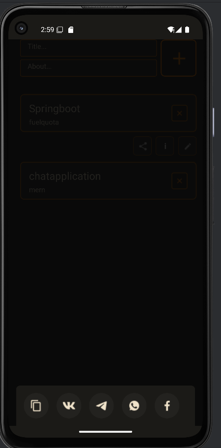
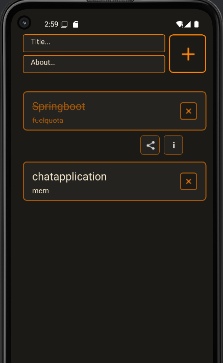

# 📋 React Native To-Do List App

A **feature-rich and visually clean To-Do List mobile application** developed using **React Native** and **TypeScript**, designed to manage daily tasks efficiently. This app supports task creation, editing, deletion, and viewing task details with smooth user interaction. It uses **Zustand** for state management and **AsyncStorage** for persistent local storage.

---

### 🎥 Demo Video

[Watch Demo](Readmefolder/assets/projectoverview.mp4)

---

### 🎨 Figma Design

[View on Figma](https://www.figma.com/design/0voUh3g2fDdGMbKNibqygj/To-Do-List--Community-?node-id=42-188)

---

## 🧰 Tech Stack

- ⚛️ React Native CLI
- ⌨️ TypeScript
- 🐻 Zustand – Lightweight global state management
- 💾 AsyncStorage – Local persistence for tasks
- 🧩 Modular Components
- 🎨 CSS for custom styles

---

## 🚀 Core Features

- 📝 **Add Tasks** – Create tasks with title and description
- ✏️ **Edit Tasks** – Update existing tasks using a modal
- ❌ **Delete Tasks** – Confirm deletion before removing a task
- ✅ **Mark as Complete** – Toggle completion linethrough with a tap
- ℹ️ **Task Info View** – See task metadata in a detailed modal
- 📤 **Share Tasks** – Share via WhatsApp, Telegram, Facebook, VK, or copy to clipboard
- 💾 **Persistent Storage** – Tasks are saved locally using AsyncStorage
- 🧠 **Zustand Store** – Centralized task state logic
- 📜 **FlatList UI** – Performance-optimized list rendering

---

## ⚙️ Getting Started

### 📋 Prerequisites

- Node.js
- Android/iOS device or emulator

### 🛠️ Installation

```bash
git clone https://github.com/jeyjenushan/ToDoListMobileProject.git
cd TodoList
npm install

# Run on Android emulator or connected device
npx react-native run-android
```

---

## 📁 Project Structure

```bash
src/
├── assets/                  # App icons, images (to be created)
├── components/              # Reusable UI components
│   ├── ActionButton.tsx     # Moved to root of components
│   ├── DeleteModal/
│   │   └── DeleteModalComponent.tsx
│   ├── TaskItem.tsx
│   ├── TodoInput.tsx
│   └── TodoList.tsx
├── constants/               # Constant values
│   ├── Colors.ts
│   ├── FontFamily.ts
│   ├── responsive.ts
│   └── socialicons.ts
├── screens/                 # Screen components
│   ├── DeleteModal.tsx
│   ├── ShareSocial.tsx
│   └── TaskModal.tsx
├── services/                # Business logic/services
│   ├── storage.ts
│   ├── taskStore.ts
│   └── useTodoList.ts
├── types/                   # Type definitions
│   ├── DeleteModalProps.ts
│   ├── ShareSocialProps.ts
│   ├── Task.ts
│   └── TaskModalProps.ts
└── App.tsx                  # Main entry point
└── ...
```

---

## 📦 AsyncStorage Structure

- **`todos`**: Array of task objects

  - `id`: Unique ID
  - `title`: Task title
  - `note`: Task description
  - `completed` : Task Status

- **`taskId`**: Incremental ID tracker

---

## 👩‍💻 Author

**Jeyaruban Jenushan**  
Third Year Software Engineering Undergraduate  
[GitHub Profile](https://github.com/jeyjenushan)

---

### 📸 Screenshots

|                                           |                                           |                                           |
| ----------------------------------------- | ----------------------------------------- | ----------------------------------------- | ----------------------------------------- |
|  |  |  |
|  |  |  |  |
